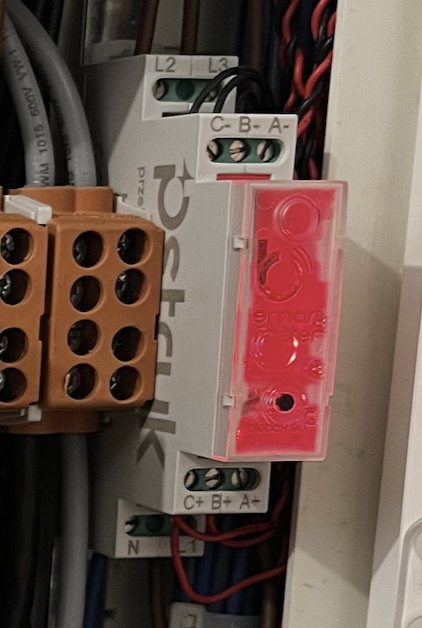
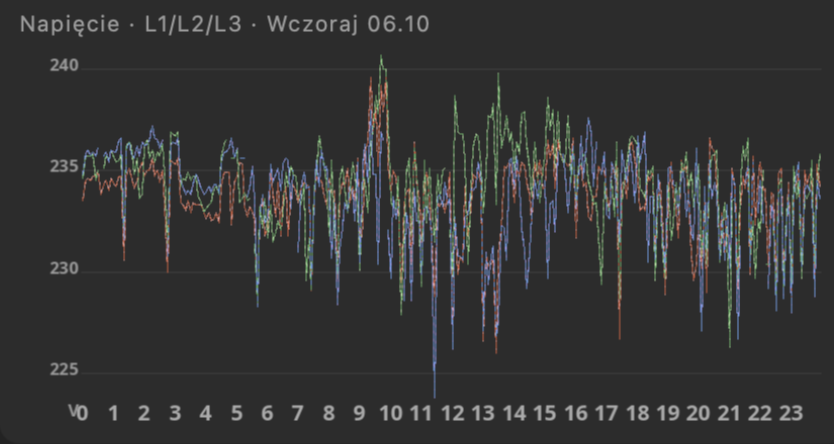

# BleBox Energy Meter — lokalny odczyt miernika energii (np. Pstryk)

> **Fully coded by Claude AI** — not a single line of code was written manually by a human.

Odczytuje **3-fazowy miernik energii BleBox** — m.in. miernik dostarczany przez **Pstryk** — **lokalnie, przez sieć domową**, co kilka sekund, i zapisuje odczyty do MySQL / MariaDB (albo wypisuje jako CSV). **Bez internetu, bez chmury, bez klucza API**, bez bibliotek — jeden plik PHP + dwa skrypty.

Mając te dane u siebie, możesz np.:

- widzieć **moc chwilową na każdej fazie** i wiedzieć, co właśnie pracuje w domu,
- pilnować, żeby **prąd na fazie nie zbliżał się do zabezpieczenia** (np. przy grzałkach, ładowarce auta, piekarniku),
- śledzić **napięcie na fazach** — za wysokie wyłącza falownik PV, za niskie wskazuje problem w sieci,
- liczyć zużycie w dowolnych okresach z dokładnością do sekund,
- porównać pomiary z licznikiem operatora (np. [energa-mojlicznik](https://github.com/tymoteuszrogalewski/energa-mojlicznik)).

*English: local (LAN, no cloud) reader for the BleBox 3-phase energy meter (e.g. the Pstryk meter) — power, voltage, current per phase every few seconds, into MySQL/MariaDB or CSV.*

<h3>Co potrafi:<br>moc · napięcie · prąd na L1 / L2 / L3 · moc bierna i pozorna · częstotliwość · energia pobrana i oddana · co kilka sekund · lokalnie</h3>

<br>
*Miernik 3-fazowy BleBox (dostarczany przez Pstryk) w rozdzielnicy, na szynie DIN.*

### Przykład zastosowania — TymOS

Tak wykorzystuję te dane w [TymOS](https://github.com/tymoteuszrogalewski/tymos), moim systemie automatyki domowej:

<br>
*Moc chwilowa na fazach L1/L2/L3 z progami ostrzegawczymi i paskami pracy urządzeń (grzałki w buforze, pralka, suszarka, zmywarka).*

<br>
*Napięcie na fazach L1/L2/L3 przez całą dobę.*

## Pliki

```
go.sh               jeden odczyt na ekranie — sprawdzenie, czy działa
log.sh              zapis odczytów co kilka sekund (do bazy albo CSV)
meter.inc.php       biblioteka: odczyt, zapis
meter_now.php       to, co uruchamia go.sh
meter_log.php       to, co uruchamia log.sh
config.example.php  wzór konfiguracji
schema.sql          tabela meter_readings
```

## Wymagania

- miernik energii BleBox (np. miernik Pstryk) w tej samej sieci co komputer / Raspberry Pi
- PHP 7.4+ z rozszerzeniami `curl` i `mysqli` (na Debianie / Raspberry Pi OS: `apt install php-cli php-curl php-mysql`)
- MySQL / MariaDB — opcjonalnie (bez bazy dane lecą jako CSV)

## Instalacja

```bash
git clone https://github.com/tymoteuszrogalewski/blebox-energy-meter.git
cd blebox-energy-meter
cp config.example.php config.php
nano config.php                     # adres IP miernika, dane bazy
mysql meter < schema.sql            # tylko przy zapisie do bazy
./go.sh                             # test
```

Adres IP miernika znajdziesz w aplikacji BleBox (ustawienia urządzenia) albo na liście urządzeń w routerze. Warto przypisać mu w routerze stały adres.

```
$ ./go.sh
Moc:            578 W   (bierna -218 var, pozorna 937 VA)
Czestotl.:    50.01 Hz
Energia:    155.278 kWh pobrana, 0.000 kWh oddana
L1:             394 W   239.0 V    2.50 A
L2:             145 W   237.5 V    0.95 A
L3:              39 W   237.3 V    0.50 A
```

## Zapis ciągły

`./log.sh` zapisuje odczyt co `METER_INTERVAL` sekund (domyślnie 10) i działa bez końca. Na stałe najlepiej jako usługa systemd — plik `/etc/systemd/system/blebox-meter.service`:

```ini
[Unit]
Description=BleBox energy meter logger
After=network-online.target mariadb.service

[Service]
ExecStart=/usr/bin/php /sciezka/blebox-energy-meter/meter_log.php
Restart=always
RestartSec=10

[Install]
WantedBy=multi-user.target
```

```bash
systemctl daemon-reload
systemctl enable --now blebox-meter
```

Co 10 sekund to ok. 3 mln wierszy rocznie (kilkaset MB) — w `schema.sql` jest przykład sprzątania starszych odczytów.

**Tryb CSV** — ustaw `DB_NAME` na `''`. Kolumny jak w tabeli poniżej, rozdzielone `;`.

## Tabela

| kolumna | znaczenie |
|---|---|
| `ts_utc` / `ts_local` | czas odczytu w UTC (klucz) i czas polski |
| `power` | moc czynna, suma faz, W |
| `reactive_power` / `apparent_power` | moc bierna var / pozorna VA |
| `frequency` | częstotliwość sieci, Hz |
| `energy_import` / `energy_export` | stan licznika energii pobranej / oddanej, kWh — zużycie w okresie = różnica |
| `l1_power`, `l1_voltage`, `l1_current` … `l3_*` | moc W, napięcie V, prąd A na każdej fazie |

```sql
-- zużycie godzinowe dziś, kWh
SELECT DATE_FORMAT(ts_local, '%H:00') h, MAX(energy_import) - MIN(energy_import) kwh
FROM meter_readings WHERE ts_local >= CURDATE() GROUP BY h ORDER BY h;

-- najwyższy prąd na fazach w ostatniej dobie
SELECT MAX(l1_current), MAX(l2_current), MAX(l3_current)
FROM meter_readings WHERE ts_local >= NOW() - INTERVAL 1 DAY;
```

## Uwagi

- Miernik odpowiada lokalnie przez HTTP (`http://IP/state`) — bez logowania. Nie wystawiaj go do internetu.
- Ceny i koszty energii z konta Pstryk pobiera osobny moduł [pstryk-api](https://github.com/tymoteuszrogalewski/pstryk-api).
- BleBox i Pstryk nie są powiązani z tym projektem.

## Pochodzenie

Moduł wydzielony z [TymOS](https://github.com/tymoteuszrogalewski/tymos) — lekkiego systemu automatyki domowej na Raspberry Pi.

## Licencja

MIT — patrz [LICENSE](LICENSE).
